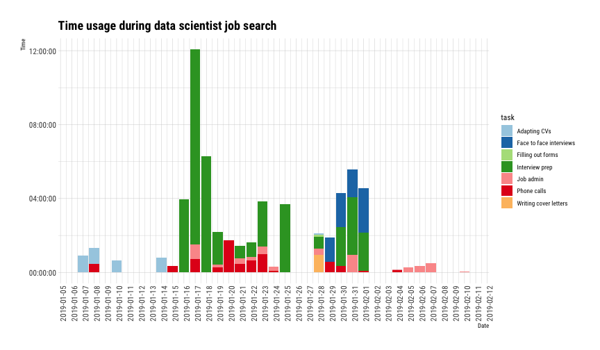
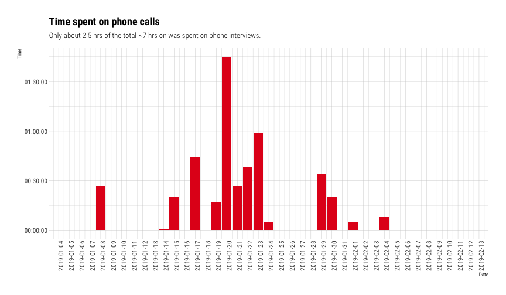
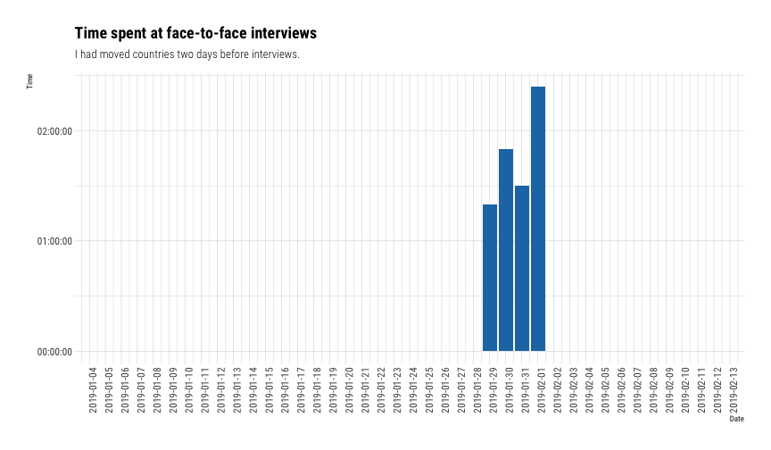
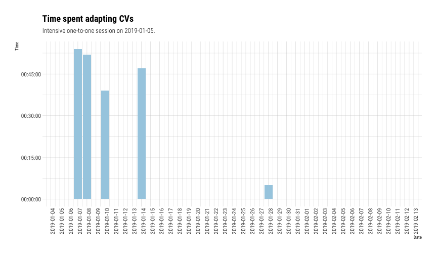

class: inverse, center, middle

# Keep in touch

<a href="mailto:acastillogill@gmail.com"><i class="fa fa-paper-plane fa-fw"></i>&nbsp; acastillogill@gmail.com</a> 
<a href="https://acastillogill.com/"><i class="fa fa-link fa-fw"></i>&nbsp; acastillogill.com </a> 
<a href="http://twitter.com/acastillogill"><i class="fa fa-twitter fa-fw"></i>&nbsp; @acastillogill</a> 
<a href="https://www.linkedin.com/in/acastillogill/"><i class="fa fa-linkedin fa-fw"></i>&nbsp; @acastillogill</a> 
<a href="http://github.com/acastillogill"><i class="fa fa-github fa-fw"></i>&nbsp; @acastillogill</a> 

---

# Why do this presentation 

- Learn from others
- Help others
- Future self

---

# Here's how I spent my time

Full blogpost [here.](https://acastillogill.com/2019/02/data-science-interviews/)
<!-- -->

---

class: inverse, center, middle

# Four lessons learnt 
## (the not so easy way)

---

background-image: url("https://media.giphy.com/media/l0HlNHy5MTxgg56lW/giphy.gif")
background-size: 60%
background-position: 50% 50%
class: center
# Establish healthy boundaries with recruiters

---

# Establish healthy boundaries with recruiters

<!-- -->

---

background-image: url("https://cdn-images-1.medium.com/max/1600/1*mgXvzNcwfpnBawI6XTkVRg.png")
background-size: 50%
background-position: 50% 50%
class: center
# Focus on the basics

---

background-image: url("https://media.giphy.com/media/SbGTbK8EBb08o/giphy.gif")
background-size: 50%
background-position: 50% 50%
class: center
# Schedule interviews at favourable times

---
# Schedule interviews at favourable times

<!-- -->

---

background-image: url("https://media.giphy.com/media/40a263o3XOpkaGFHrS/source.gif")
background-size: 80%
background-position: 50% 50%
class: center
# Practice **this** public speaking skill

---

class: inverse, center, middle

# Four things to do again 
## Yo go girl!

---

background-image: url("https://mediaslide-europe.storage.googleapis.com/premier/pictures/3695/7841/large-1464701629-b5a421eed8ec4a169e5a5541ea0ce4cf.jpg")
background-size: 40%
background-position: 50% 50%
class: center

# Be yourself (or as close as possible)

.footnote[
Image by [Polly Nor](https://www.pollynor.com/)]
---

background-image: url("https://media.giphy.com/media/1n833bZxdzKzaErLe9/giphy.gif")
background-size: 50%
background-position: 50% 50%
class: center

# Have a mentor to support you along the way
---

# Have a mentor to support you along the way
<!-- -->

---

background-image: url("https://media.giphy.com/media/5hkF0WXKLqDW4GoejJ/source.gif")
background-size: 40%
background-position: 50% 50%
class: center

# Be transparent about other interviews

---

background-image: url("https://media.giphy.com/media/l2SpUoAPo0CBOkyxq/giphy.gif")
background-size: 50%
background-position: 50% 50%
class: center

# Be kind to everyone you meet 

**(no matter what)**

---

class: center, middle, inverse

# Thank you!

Slides created via the R package [**xaringan**](https://github.com/yihui/xaringan).

R-Ladies theme created by [**Alison Presmanes Hill**](https://alison.rbind.io/).
